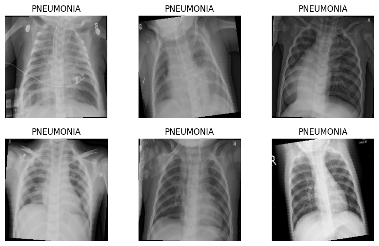

# FINAL_MACHINE_LEARNING_PROJECT
### BY: Sumukh Sudhir Jagirdar, Aedin Cowan, Brian Chan, Joys James

## Chest X-Ray Pneumonia Dataset
The dataset used for this project is the **Chest X-Ray Images (Pneumonia)** dataset, available on [Kaggle](https://www.kaggle.com/datasets/paultimothymooney/chest-xray-pneumonia)

It contains X-ray images classified into 2 categories:
- NORMAL: Healthy Lungs
- PNEUMONIA: Lungs showing signs of pneumonia infection

### Data Preprocessing Pipeline
The dataloader pipeline is defined in [`dataloader.py`](./dataloader.py).
A Jupyter version is defined in [`dataloader.ipynb`](./dataloader.ipynb).

They include the following processing and augmentation steps:
**Training Transformations**
- Convert grayscale to RGB (`transforms.Grayscale(num_output_channels=3)`)
- Resize to `(224, 224)`
- Random horizontal flip (data augmentation)
- Random rotation up to +- 10 degrees
- Convert to tensor
- Normalize using ImageNet statistics:
  - Mean = `[0.485, 0.456, 0.406]`
  - Std = `[0.229, 0.224, 0.225]`

**Validation & Test Information**
- Convert grayscale to RGB
- Resize to `(224, 224)`
- Convert to tensor
- Normalize using the same ImageNet statistics

### Dataloader Setup
Each subset of the dataset is loaded using PyTorch’s `ImageFolder` and `DataLoader` utilities:

|  Dataset   | Shuffle | Batch Size |       Purpose         |
|------------|---------|------------|-----------------------|
|   Train    |   Yes   |     32     |    Model training     |
| Validation |   No    |     32     | Hyperparameter tuning |
|    Test    |   No    |     32     |   Final evaluation    |

```python
train_data = datasets.ImageFolder(root=train_dir, transform=train_transform)
train_loader = DataLoader(train_data, batch_size=32, shuffle=True)
```

### Dataset Summary
| Dataset | NORMAL | PNEUMONIA | Total |
| Train | 1341 | 3875 | 5216 |
| Validation | 8 | 8 | 16 |
| Test | 234 | 390 | 624 |

### Visualization Example
Below are sample training images after preprocessing:

<p align="center">
  
</p>
